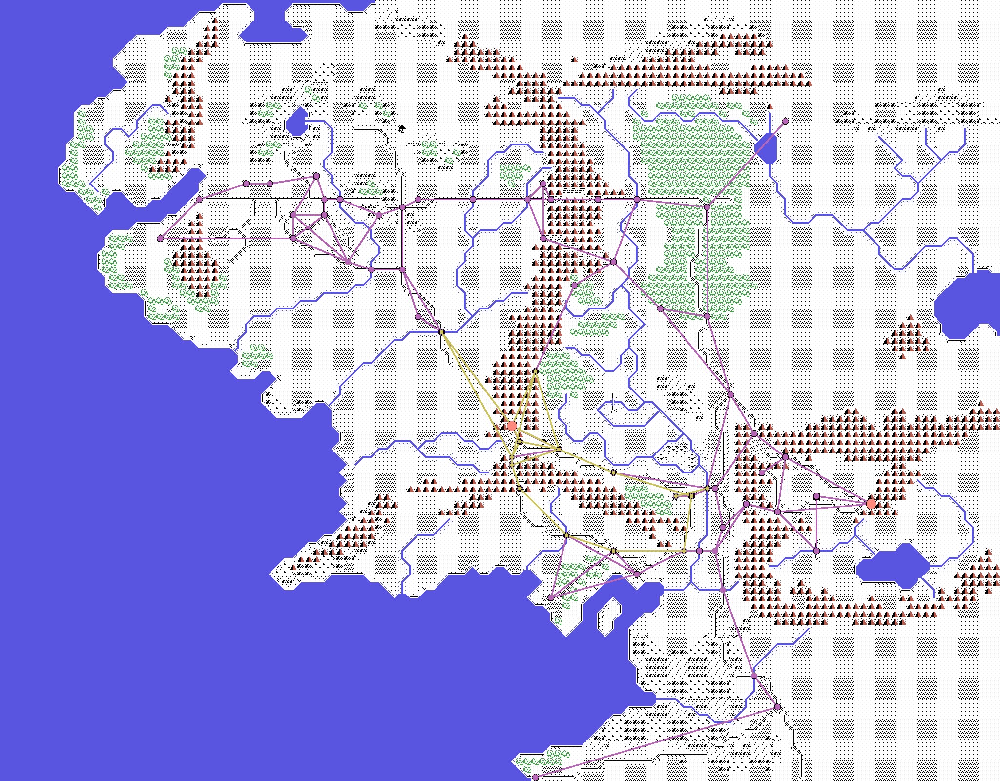
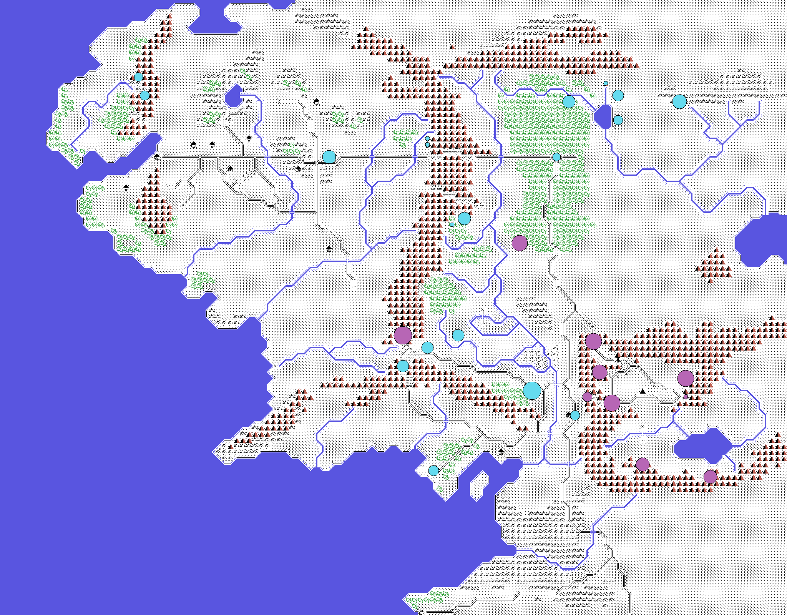

# How the machine plays

What the computer is really doing while you stare at the map: where it sends its
armies, how it fights, and why Gandalf and Aragorn keep vanishing on you.

Everything here was read in the disassembly, not played. Each section ends with
the exact routines it came from, in case anyone wants to check.

## The short answer

There is no plan. The machine does not know where you are, is not coming for
you, defends nothing and never changes its mind. All it does is take an army,
look up which road junction it is standing on and **toss a coin** to pick which
of the two exits to follow. Then again. And again, for the whole game.

Everything else — the feeling of being surrounded, of them turning up exactly
where you didn't want them, of a hero disappearing without warning — comes out
of that coin and three or four very dumb rules.

## One piece per turn, and back in the queue

The game keeps a list of 256 pieces: your characters, your armies and Sauron's,
all mixed into the same list. Each time round the loop it **moves exactly one**,
the next on the list, and hands over the turn. When it reaches the end it starts
again at the first.

No unit moves "faster" for being important: they all get the same turn, and the
machine does not choose which one to move. Whoever's turn it is, moves.

> In the listing: `MUEVE_LA_SIGUIENTE_UNIDAD` (0x6719). The piece number lives
> inside the instruction itself and wraps round on overflow.

## Middle Earth has roads, and these are they

When one of the machine's armies gets its turn and has already arrived where it
was going, it needs a new destination. It does not choose one: the game ships a
**network of junctions**, and each junction has exactly two places written down
that you can go on to. The computer finds the junction it is standing on, tosses
the coin and heads for the other one.

There are two separate networks. A large one of 64 junctions covering the whole
map, and a small one of 15 that is the central corridor. And the small one is
nothing but **a slice of the large one, renumbered**: its fifteen junctions are
fifteen of the sixty-four, with the exits rewritten to point inside the short
list.

Which network you get depends only on your number in the list: the armies in the
last stretch use the small one, those in the stretch before it the large one,
Sauron the large one and Saruman the small one. The named characters use
neither, because you move those yourself.

The junctions land right on top of the roads the game draws on its own map: not
a coincidence, it is the same network. The straight lines in the picture are
only "from this junction to the next one"; the actual path is improvised square
by square by the unit.

One look at that picture explains something anyone who has played will have
noticed: the dark armies always show up in the same places. They can only show
up there.

> In the listing: `DESTINO_POR_LA_RED_GRANDE` (0x69C1), with the 64-point table
> at 0x6BFB, and `DESTINO_POR_LA_RED_CHICA` (0x6993), with the 15 at 0x6CFB.
> Each point is four bytes: column, row and its two exits. The split, in
> `REPARTE_POR_NUMERO` (0x6A17).

## A step that way, and a swerve

With the destination set, walking is simple: work out which way it lies and take
a step that way… *almost*. Before taking the step the game pulls a random number
and adds a swerve to the direction, so sometimes it comes out crooked. That is
why the troops don't walk in straight lines and look like they are hesitating.

The swerve is not evenly spread. Out of every sixteen draws, ten go straight,
four veer one way and only two the other: the machine **leans harder to one side
than the other**.

If the terrain won't let it through, it tries twice more with another swerve,
and failing that it starts working round the obstacle: it looks both ways to see
which side gets out sooner and hugs that edge until it is clear. The code that
carries on working round on later turns **has a bug** and always turns the same
way, whether or not it pays.

And terrain matters per troop type: each class of unit carries its own little
table of sixteen terrains with what each one costs. Two terrains are marked
impassable for everyone, and others cost five times what a road costs. That cost
is not just time: it is the number of turns the unit stands still before it can
move again.

That table, incidentally, has **ten entries and not sixteen**. The troop types
the tape actually uses run from 0 to 9, and the game's code begins right behind
the tenth entry.

> In the listing: `DA_UN_PASO` (0x67C5), the sixteen swerves at 0x6B23,
> `TRES_INTENTOS` (0x6809), and the detour in `BUSCA_HUECO_GIRANDO` (0x686E) and
> `SIGUE_RODEANDO` (0x68BD), with the bug at 0x68CA. The terrain entries, at
> 0x6D47.

## Walking is tiring, and the tired stop dead

Every unit carries a number that drops each time it moves. When it falls below a
floor, the unit **stops wherever it is** and rests until it recovers; only then
does it walk again. Nobody decides that: it is automatic, and it happens to your
armies exactly as it happens to Sauron's.

That same number later decides how much life its soldiers have in a battle.
Troops that arrive worn out from walking fight worse. It is the closest thing to
a tactical idea in the whole game, and it isn't even a decision: it is a
subtraction.

> In the listing: the counter is at 0xC200+n, decremented at 0x6752, and below
> 11 it jumps to `SE_PLANTA` (0x6951). `DESCANSA` (0x6945) takes it back up to
> 40.

## The deployment isn't computed: it comes on the tape

You would expect the computer to lay out its armies when a game starts. It does
nothing of the sort. **The positions of all 256 pieces come recorded on the
tape**, as they are, and starting a new game only sets the clock going. Game one
and game one hundred begin exactly the same.

That is everything in the game, in its first second. The named characters start
bunched into a single square. Sauron has more troops than you from the start,
and has them in fewer, fatter piles.

Sauron, on top of that, never leaves his tower. In the full game measured on the
emulator he did not take a single step; and there is a rule saying that **if you
do manage to destroy his army, he is put back on his square with full strength**.
He cannot be removed from there.

> In the listing: the state strips 0xB900 (column), 0xBA00 (row), 0xBD00 (type)
> and 0xC500 (troops), which arrive inside the tape's high block.
> `EMPIEZA_PARTIDA_NUEVA` (0x7F43) only touches the 0xC600 state. Sauron's
> restoration, in `PON_EL_EJERCITO_16_EN_SU_SITIO` (0x922C).

## Nobody decides to enter a battle

The battle is not chosen. Every time a piece — any piece — takes a step, the game
counts who is on that square; if both sides are there, **battle, and no
questions asked**. All it takes is an orc patrol walking over where you happened
to be standing.

What happens then:

1. The strength of each side on that square is added up. If they don't all fit
   on the board it is trimmed with a quota, and those left out sit the fight
   out.
2. The board is laid out as a draughtboard: you only move diagonally, so pieces
   never change square colour. **Fifteen obstacles are thrown at random** across
   the middle.
3. Each figure is dropped on a drawn square. The draw is loaded: one side comes
   out biased towards one edge and the other towards the opposite one, so the
   fight starts face to face without anyone having ordered it.

> In the listing: `REPARTE_LOS_QUE_ENTRAN` (0x8F70) and the quota at 0x8FD1; the
> draughtboard and obstacles at 0x9070; the loaded draw, with the band table
> built at 0x908D and flipped for the second side at 0x90F7.

## Every figure is on its own

There is no single command here either. Each figure, on its turn, does this: if
something is already touching it, it fights; if not, it **looks for the nearest
enemy — but only within a distance drawn at that moment**. If the draw comes out
short, it sees nobody even with someone three squares away.

To walk towards its target it has two ways of picking the diagonal — check one
coordinate first, or the other — and it **tosses for which one to use**. If the
square it was heading for is taken, it tries another diagonal, also at random.
And if that one is taken too, it stays put.

Turns go round a wheel of four: one pass resolves the blows, the next moves one
side, and two of the wheel's four slots **are empty** and do nothing at all.
Hence that odd, lurching rhythm the battle has.

A blow is a die against a number: if the roll comes in under what that figure
hits for, it takes life off the other one. At zero it falls. A few troop types
get back up as many as four times with full life before going down for good; the
rest, never.

> In the listing: `MUEVE_LAS_UNIDADES` (0x897D), `BUSCA_A_QUIEN_PERSEGUIR`
> (0x8A86) with the drawn distance at 0x8A8E, the two direction routines (0x8908
> and 0x8925) with the toss at 0x89B4, the wheel of four at 0x9163 over the
> table at 0x94B7, and the blows in `RESUELVE_LOS_COMBATES` (0x8E95).

## The difficulty level is one single thing

The menu offers "6. Level", 1 to 15, and you would assume that decides how many
troops Sauron brings, or how clever he is. It does not. When the game starts,
that number is handed out **only to the units of one type: the orcs**, and the
only thing it changes is **how often they hit**.

The thing is, orcs are nearly all of Sauron's army — 132 units out of his 138,
and 2,223 of his 2,235 figures — so the difference tells. And it tells a lot,
because the number is **multiplied by itself** before being used:

| level | an orc hits |
|---|---|
| 1 | 0.4% of blows |
| 5 | 9.8% |
| 10 | 39.1% |
| 15 | 87.9% |

At level 1 they can barely land one; at 15 they hardly miss. What each blow
takes off, the figures' life, how many troops there are or how they move about
the map: **the level touches none of it**. Nor does it touch the Ring.

> In the listing: `REPARTE_EL_NIVEL` (0x5E8D) writes the level into the low
> nibble of 0xC100 for type-5 units. In battle, 0x8D29 multiplies it by itself
> into 0xE400, which is what the random byte at 0x8ED0 is thrown against.

## Why Gandalf and Aragorn disappear

The old explanation — "they run out of army" — **does not hold**, and anyone who
has played a lot is right not to swallow it. The named characters **never have an
army at all**: the slot saying how many troops a piece carries reads **zero** for
all twenty-four, from the moment the tape finishes loading. They travel alone.

And there is the problem. When a figure falls on the board, the game goes to take
a soldier off the army it belonged to, but first checks whether any are left. It
finds that zero, reads it as *"nothing left"* and **wipes the piece off the map
there and then**. No wearing down, no warning, no second chance: the character
disappears at the first blow that puts his figure down.

Two more things on top of that:

- **You don't decide to enter the battle.** If an enemy army steps onto the
  square your hero was on, in he goes.
- **When the battle ends, the losing side is wiped off the map entirely.**
  Everyone who went in, whether their figures fell or not. A character can
  disappear without anyone ever touching him, purely for being on the wrong
  square when his side loses.

The only thing telling them apart is how many times their figure gets back up
before falling: Gandalf is one of the four-times ones and Aragorn gets up not at
all. That is why Gandalf lasts half a game and Aragorn goes early, over and over.
It isn't bad luck: it's his troop type.

> In the listing: the zero read as exhausted, at 0x8F06, which jumps to
> `EJERCITO_DESHECHO` (0x8F0D) and on to `BORRA_EL_EJERCITO_DEL_MAPA` (0x8F1A).
> The wiping of the losing side, at 0x91B4 and 0x91CE, dealt out by 0x91DB. The
> four recoveries, in `CUATRO_SI_ES_TIPO_0_1_O_7` (0x8DC0).

## The easiest way to lose, and it gives no warning

There is one square on the map the game watches **every time round the loop**:
Minas Tirith. If **no** unit of yours is left standing on it and at least one of
the enemy's is, the game ends right there. No battle, no message, nothing: the
defeat screen.

And there is a catch. When you give an order on a square, **it goes to every
unit standing there**, not to the one you had in mind. Minas Tirith starts with
**twenty-one**: Denethor and twenty armies of Gondor. One order and the whole
garrison marches out.

We have watched it happen in a real game. Ninety seconds in, the player gave an
order on that square and all twenty-one set off; ten seconds later Minas Tirith
was empty. On day 49 of the first month a unit of Sauron's walked up, found the
city undefended, and that was the end of the game: **not one battle fought**.

So the practical rule is short: **never empty Minas Tirith**. Leaving a single
unit inside keeps this from firing.

> In the listing: `MIRA_QUIEN_ESTA_EN_LA_CASILLA_56_3F` (0x92DE) and its jump to
> defeat at 0x9309. It has two callers, and the one that matters is **0x7F80,
> inside the game loop**. That (0x56,0x3F) is Minas Tirith comes from the game's
> own table of places, at 0x7A5E. The order that moves the whole square is
> `ORDEN_PARA_TODOS` (0x7280).

## What the machine does not do

Having read the whole program, the list of what is *not* there is shorter to
write than the list of what is:

- It never looks at where the player is. Nowhere in the code is that asked in
  order to decide a move.
- It never masses troops or sends them at a common objective: each army tosses
  its own coin at its own junction.
- It defends nothing, does not protect Sauron and does not cut roads.
- It does not learn or shift behaviour as the game goes: the clock exists only
  so that your time runs out.
- And in battle, no figure knows what its own side is doing.

What there is instead is a huge map, plenty of troops spread over it and a great
many coin tosses a second. That is enough to make it feel like somebody is
playing against you. And in a way it works better this way: a 1988 machine with
a real plan would have been more predictable than this one, which has none.

## The pictures on this page

They are not screenshots. The map is decompressed exactly as the game does it at
boot and painted square by square repeating what its drawing engine does; the
junctions of both networks and the starting positions are then marked on top,
straight from the tape's data. `tools/render_redes.py` makes them, and if any of
those ranges were mislabelled the result would be noise instead of Middle Earth.
